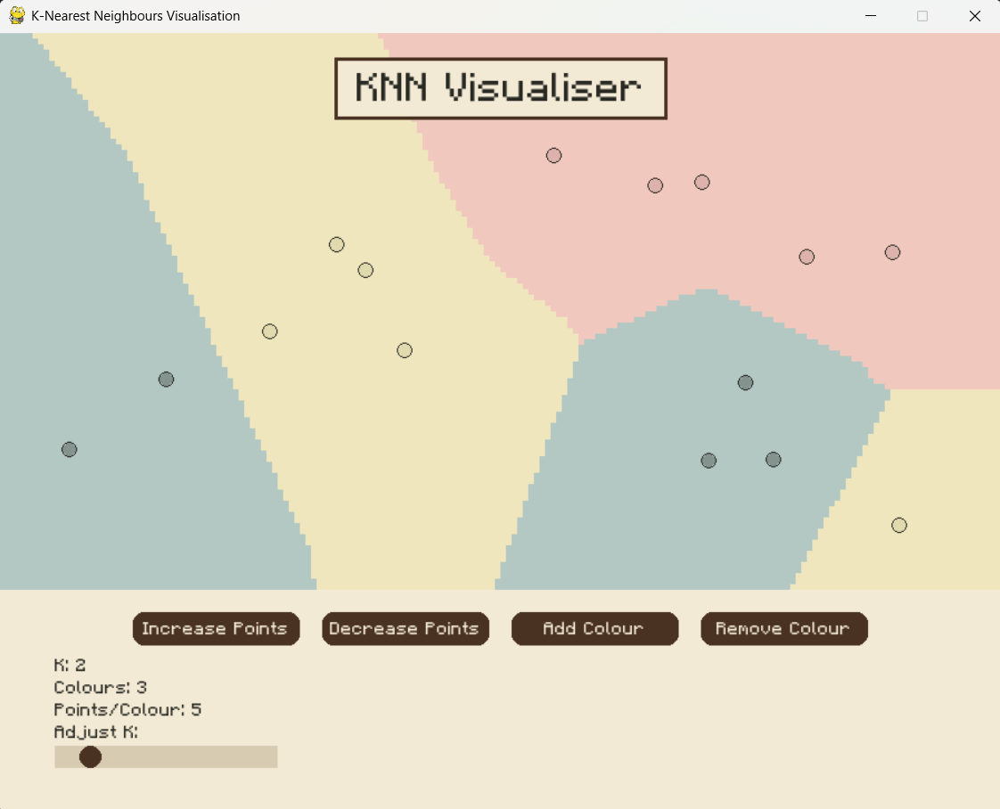

# **KNN Visualizer**

A Python application for visualizing the **K-Nearest Neighbors (KNN)** algorithm using **Pygame**. This interactive tool allows you to experiment with different parameters, such as the number of points, colors, and the value of **K**, to see how the KNN algorithm classifies points on a grid.

---

## **Features**
- **Interactive Grid**: Click and drag points to see how the KNN algorithm classifies them in real-time.
- **Customizable Parameters**:
  - Adjust the number of points per color.
  - Change the number of colors.
  - Modify the value of **K** (number of neighbors).
- **Dynamic Visualization**: The grid updates automatically as you move points or change parameters.
- **User-Friendly Interface**: Buttons and sliders make it easy to interact with the application.

---

## **Screenshots**
  
*Example of the KNN Visualizer in action.*

---

## **Requirements**
- Python 3.12
- Pygame

---

## **How to Run**
1. **Clone the Repository**:
   ```bash
   git clone https://github.com/william-zhuo/KNN.git
   cd KNN
   ```

2. **Install Pygame**:
   If you don’t have Pygame installed, run:
   ```bash
   pip install pygame
   ```

3. **Run the Application**:
   ```bash
   python app.py
   ```

---

## **How to Use**
1. **Add Points**:
   - Use the **Increase Points** button to add more points of the current colors.
   - Use the **Decrease Points** button to remove points.

2. **Change Colors**:
   - Use the **Add Color** button to introduce a new color.
   - Use the **Remove Color** button to reduce the number of colors.

3. **Adjust K**:
   - Use the slider to change the value of **K** (number of neighbors).

4. **Drag Points**:
   - Click and drag points to see how the classification changes in real-time.

---

## **File Structure**
```
KNN-Visualizer/
├── app.py                     # Main application script
├── MinecraftRegular-Bmg3.otf  # Custom font file
├── README.md                  # This file
└── screenshots/               # Screenshots
    ├── screenshot-1.png
    └── screenshot-2.png
```

---

## **Customization**
- **Font**: Replace `MinecraftRegular-Bmg3.otf` with your preferred font file and update the path in the code.
- **Colors**: Modify the `COLORS` and `LIGHTER_COLORS` lists in the code to use your own color schemes.

---

## **Acknowledgments**
- Thanks to the **Pygame** community for their amazing library.
- Inspired by educational visualizations of machine learning algorithms.
- Special thanks to Kyle Sava, who motivated our team to create this.

---

### **Enjoy Visualizing KNN! 🚀**

---
